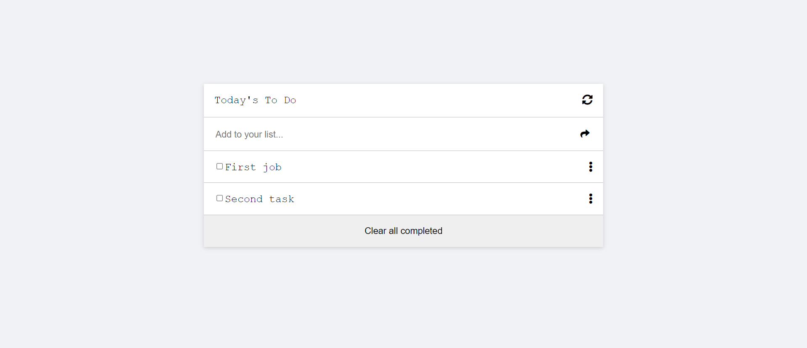

# Portfolio

> To do List



## Getting Started
**step1** cloning the project:
```
git clone https://github.com/beyk/To-do-list.git
```
**step2** 
```
npm install
npm run build
```
**step3** Development:
```
npm install --save-dev webpack-dev-server
npm start   
```
## Live Demo

[Live Demo Link](https://beyk.github.io/Todolist/)

## Built With

- HTML
- CSS
- Javascript
- VSCode
- Linters
- WebPack

## Authors

👤 **Beyk**

- GitHub: [@Beyk](https://github.com/beyk)
- LinkedIn: [LinkedIn](https://www.linkedin.com/in/asghar-beykmohammadi-1b16b291/)
- Twitter: [@Beyk_a](https://twitter.com/beyk_a)

## 🤝 Contributing

Contributions, issues, and feature requests are welcome!

Feel free to check the [issues page](#).

## Show your support

Give a ⭐️ if you like this project!!

## 📝 License

This project is [MIT](./LICENSE) licensed.

